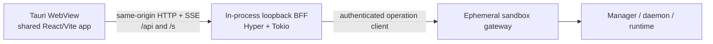

# Phase 1: Ephemeral Sandbox Tauri Dashboard Specification

Status: Proposed<br>
Date: 2026-07-18<br>
Target: `ephemeral-sandbox-console/desktop` and the shared `web` application
Primary route: `/` (Dashboard)

## 1. Outcome

Phase 1 delivers a Tauri 2 desktop application whose first screen is the
Ephemeral Sandbox Dashboard shown in the Stitch export. The desktop application
must use the existing React console and Rust backend-for-frontend (BFF), not a
second desktop-only UI implementation.

The main page must let a user:

- see sandbox totals and live resource/activity summaries;
- search sandboxes by ID, lifecycle state, or workspace path;
- create a sandbox;
- open a ready sandbox or inspect a failed sandbox;
- destroy a sandbox through the existing confirmation flow; and
- understand loading, empty, stale, disconnected, and lifecycle-transition
  states without fabricated data.

The visual direction is **Humanistic Computing / Warm Glassmorphism**: a calm,
cream-and-walnut developer tool with slate-blue controls, monospaced technical
data, translucent tactile cards, and a large mascot illustration behind the
Dashboard content.

Browser and desktop builds consume one React application and one public asset
tree. The desktop package must not fork either the UI or its web-visible brand
assets.

## 2. Design sources and precedence

The Stitch source export used to write this specification is currently located
at:

`/Users/yifanxu/Downloads/stitch_ephemeralos_console_redesign`

| Source | Purpose | Precedence |
| --- | --- | --- |
| [Stitch project](https://stitch.withgoogle.com/projects/9670561760757600286) | Original project context | Reference |
| `screen.png` | Canonical visual composition at 1600 × 1280 | Highest for appearance |
| `DESIGN.md` | Brand language, tokens, typography, spacing, and responsive intent | Highest for design-system semantics |
| `code.html` | Component anatomy, hover/motion hints, and sample content | Reference only |
| `shared/assets/source/ephemeral-sandbox-mascot.png` | Repository-owned application icon and page artwork | Highest for product imagery |
| Existing `web` and `server` code | Real behavior, data contracts, routing, security, and error handling | Highest for product behavior |

Paths under `/Users/yifanxu/Downloads` are provenance and one-time import
locations only. No source file, stylesheet, test, configuration, build script,
or packaged application may reference an asset outside
`ephemeral-sandbox-console`.

Do not copy `code.html` into production. It depends on Tailwind CDN, Google Font
CDNs, Material Symbols, sample values, and a remotely hosted background asset.
The production implementation must use the repository's React/Mantine stack,
local assets, and live APIs.

### Resolved source conflicts

- `screen.png` includes Dashboard, Sandboxes, Deployments, and Metrics
  navigation, but the export has no corresponding pages and the current app has
  no such top-level routes. Phase 1 renders only the functional **Sandboxes**
  destination. No disabled or dead navigation controls.
- `screen.png` includes health, settings, and account icon buttons without
  defined behavior. Phase 1 omits them. They return only with a product and
  route specification.
- `screen.png` says **Commands/s**, but the current API exposes active
  executions, not an execution rate. Phase 1 labels the metric **Active
  Commands**. A rate must not be inferred from polling frequency.
- `DESIGN.md` contains both `#25485e` and `#3e6077` as primary-like colors,
  while the prose, HTML, and screenshot consistently use `#3e6077` as Eye
  Blue. Phase 1 uses `#3e6077` for the primary control and `#25485e` for its
  pressed/darker state.
- The screenshot footer contains a hard-coded 2024 copyright and a Terms link
  with no destination. Phase 1 uses the current year and omits Terms until a
  real URL exists.
- The product name is **Ephemeral Sandbox**. Replace the earlier name wherever
  it appears in the Stitch reference.
- The user-supplied 1024 × 1024 cat-in-sandbox PNG replaces the remote Stitch
  illustration as the approved source for both page art and generated desktop
  application icons.

## 3. Scope

### In scope

- A Tauri 2 application shell for macOS development, structured so Windows and
  Linux can follow without a frontend rewrite.
- The shared Dashboard route at `/`, redesigned to match the Stitch reference.
- A redesigned shared header on the Dashboard route.
- Live metric aggregation from the existing sandbox-list, snapshot, and cgroup
  data.
- Search, create, open/inspect, and destroy behavior already present in the web
  console.
- Responsive desktop, tablet, and narrow-window layouts.
- Browser visual, functional, accessibility, and security tests.
- A Tauri launch smoke test and graceful BFF shutdown.

### Out of scope

- Dashboard, Deployments, or Metrics pages.
- Redesigning sandbox detail, terminal, files, preview, or observability pages.
- Native menus, tray, notifications, global shortcuts, auto-update, deep links,
  or OS credential storage.
- User accounts or cloud authentication.
- App Store submission, notarization, and Windows signing. These are later
  release phases.
- Replacing the existing HTTP/SSE/WebSocket BFF contract with Tauri IPC.

## 4. Page anatomy

```text
┌──────────────────────────────────────────────────────────────────────┐
│ Ephemeral Sandbox ● Console  Sandboxes              [New Sandbox]   │
├──────────────────────────────────────────────────────────────────────┤
│ [Total] [Ready] [Active Commands] [Avg Memory]   (mascot backdrop) │
│                                                                      │
│ Your sandboxes                                  [Search (Press /)] │
│ ──────────────────────────────────────────────────────────────────── │
│ [Ready sandbox]   [Active sandbox]   [Failed sandbox]              │
│                                                                      │
│ Loading / empty / stale / disconnected feedback when applicable    │
├──────────────────────────────────────────────────────────────────────┤
│ © current year Ephemeral Sandbox.       Connection status           │
└──────────────────────────────────────────────────────────────────────┘
```

The route owns vertical scrolling. The header stays visible; the footer follows
the content and rests at the bottom only when the content is shorter than the
window.

### 4.1 App header

- Height: 80px at desktop widths, 64px below 768px.
- Background: cream surface at 90% opacity with approximately 12px backdrop
  blur, a 1px walnut border at 20–30% opacity, and a subtle ambient shadow.
- Left: **Ephemeral Sandbox** in Inter 700, followed by a compact **Console**
  pill using JetBrains Mono. The green dot represents a confirmed connection,
  not a decorative always-online state.
- Navigation: the single active label **Dashboard** in Phase 1.
- Right: the filled Eye Blue **New Sandbox** action. It opens the existing
  `CreateSandboxModal` and reflects its busy state.
- Narrow layout: brand, Console state, and New Sandbox remain available. Text
  may shorten to `New` only below 420px if needed; the accessible name remains
  `New Sandbox`.

### 4.2 Brand artwork and application icon

- Canonical repository source:
  `shared/assets/source/ephemeral-sandbox-mascot.png`. It is a 1024 × 1024
  RGBA PNG in sRGB with SHA-256
  `b940877050866fb52b9e9e1142e7cffebfc5d5c77dfca26f0da5a82e00612bd3`.
- During the initial asset-import step only, copy the approved Downloads image
  to that repository path and verify the hash before generating anything.
  After import, every build and generation command must read the repository
  copy. Keep the full square cat-in-sandbox composition; do not substitute the
  Stitch-hosted artwork.
- Generate optimized, content-addressed PNG and WebP page derivatives under
  `shared/public/brand/`, for example
  `ephemeral-sandbox-mascot-b9408770.webp`. The WebP is preferred in a
  `<picture>` element and the PNG is its fallback.
- Generate packaged application icon sizes from the canonical source into
  `desktop/src-tauri/icons/`. OS packaging icons are build inputs, not public
  web assets, so they are intentionally kept outside `shared/public`.
- A large, decorative rendering sits behind the upper-right Dashboard content.
- Desktop target: roughly 560–640px square, centered near 70% of page width,
  with radial cream fades on every edge. Use a CSS mask/fade rather than
  destructively editing the canonical file.
- The artwork is `aria-hidden`, non-selectable, and `pointer-events: none`.
- It must never lower text contrast below WCAG AA. Glass cards may increase
  opacity over visually busy regions.
- At widths below 768px, hide the artwork or reduce it to no more than 12%
  opacity so it cannot compete with content.
- The packaged macOS, Windows, and Linux application icons all derive from the
  same full-square PNG. Do not use the page screenshot or the old robot logo.
- Record source filename, SHA-256, dimensions, color mode, derivative paths,
  and derivative hashes in `shared/assets/manifest.json`. Do not hotlink the
  Stitch URL or any other image host.

### 4.3 Metric grid

Four compact glass cards appear before the sandbox collection.

| Metric | Derivation | Empty value |
| --- | --- | --- |
| Total Sandboxes | `records.length` | `0` after a confirmed empty response |
| Ready | records whose manager state is `ready` | `0` after confirmation |
| Active Commands | sum of `inFlightCount(snapshot)` | `—` while snapshots are unresolved |
| Avg Memory | mean of available current-memory samples | `—` when no sample is available |

Average memory divides the sum by the number of sandboxes with a numeric
sample, not by total sandbox count. Values use binary units through the existing
formatting utilities.

Each metric card has:

- a 14px Inter label and a small Lucide icon;
- a 20–24px JetBrains Mono value;
- a 16px radius;
- cream glass at about 70% opacity;
- a 1px walnut border at 20% opacity; and
- a dual shadow: inset top highlight plus low-opacity ambient shadow.

Cards are summaries, not links, in Phase 1.

### 4.4 Dashboard collection heading and search

- Heading: **Your sandboxes**, Inter 600, 32–40px desktop and 24–32px narrow.
- A walnut divider at 20–30% opacity spans the content width.
- Search uses the existing `q` query parameter and `/` keyboard shortcut.
- Search matches sandbox ID, manager lifecycle state, derived display state, and
  workspace path, case-insensitively.
- The input keeps its visible `/` shortcut keycap on desktop. The shortcut does
  not fire while an input, textarea, or editable element has focus.
- The input uses a sunken inner shadow and a clear 2px Eye Blue focus ring.

### 4.5 Sandbox card

Desktop uses a three-column grid. Every card is a semantic `article` and
contains:

1. sandbox ID chip and status badge;
2. truncated workspace path with the full path available as a title/tooltip;
3. a 2 × 2 technical metric grid;
4. a primary contextual action; and
5. the existing destructive action with confirmation.

The metric grid maps live data as follows:

| Label | Value |
| --- | --- |
| CPU | current cgroup CPU percent |
| MEM | current cgroup memory |
| SESSIONS | `snapshot.workspaces.length` |
| ACTIVE CMDS | `inFlightCount(snapshot)` |

Do not display the Stitch sample's historical-looking values such as `45 run`;
the current API does not expose a historical command total.

Card appearance:

- cream glass surface at about 76% opacity;
- 16px corner radius;
- 1px walnut border at 20% opacity;
- 4px left lifecycle accent;
- inset top highlight and a soft ambient shadow;
- maximum hover lift of 6px on pointer devices; and
- no layout shift when badges or live values change.

Card actions:

- Ready or active: **Open** navigates to the existing sandbox detail route.
- Failed: **Inspect** navigates to the detail route. Use **Logs** only when a
  dedicated log destination exists.
- Creating: show the existing streamed creation log treatment.
- Stopping: disable Open and present lifecycle progress.
- Stopped: allow Inspect if the detail route supports it.
- Destroy: icon button with `Destroy <sandbox-id>` accessible name; always open
  `ConfirmDestroyDialog` before the RPC stream starts.

### 4.6 Display-state mapping

The manager lifecycle remains the source of truth. **Active** is a derived UI
state, not a new API state.

| Condition | Label | Color | Motion |
| --- | --- | --- | --- |
| `ready` and active commands > 0 | Active | Sky Blue `#87aec4` | Subtle pulse unless reduced motion |
| `ready` and no active commands | Ready | Green `#10b981` | None |
| `creating` | Creating | Tertiary amber | Optional progress only |
| `stopping` | Stopping | Walnut | None |
| `stopped` | Stopped | Neutral | None |
| `failed` | Failed | Red `#ba1a1a` | None |

Every status has text and a dot/accent; color is never the only indicator.

### 4.7 Feedback states

Preserve the current data-resilience behavior while restyling it:

- **Initial loading:** skeleton metric and card shapes; announce `Loading
  sandboxes…` politely.
- **Confirmed empty:** `No sandboxes yet`, supporting text, and a New Sandbox
  action.
- **No search matches:** keep the search visible and show the current query.
- **Refresh failure with cached data:** keep last confirmed data, show a compact
  stale-data alert, and continue automatic retry.
- **Gateway unavailable without cached data:** show the actionable connection
  error instead of zeros.
- **Creating/stopping:** keep the fast polling and stable card order currently
  implemented by `FleetBoard`, then move that behavior into `DashboardPage`.
- **Missing per-sandbox samples:** render `—`; never coerce unknown to zero.

## 5. Design system

### 5.1 Canonical Phase 1 tokens

| Role | Value |
| --- | --- |
| Canvas / warm ivory | `#fefdfc` |
| Cream surface | `#fffaf5` |
| Sand surface | `#f2e9de` |
| Espresso text | `#271f1c` |
| Walnut outline/secondary text | `#896c58` |
| Eye Blue primary | `#3e6077` |
| Eye Blue pressed | `#25485e` |
| Sky Blue active | `#87aec4` |
| Ready | `#10b981` |
| Failed | `#ba1a1a` |
| Focus ring | `#3e6077`, 2px with 2px offset where space allows |

Opacity is part of the component recipe, not encoded into the base tokens.

### 5.2 Typography

- Inter: page structure, headings, body, and actions.
- JetBrains Mono: IDs, paths, metric values, labels, shortcut keycaps, and
  lifecycle pills.
- Self-host only the required WOFF2 subsets under
  `shared/public/fonts/`; the desktop app must not require Google Fonts at
  runtime.
- Use `font-display: swap` and system fallbacks.
- Uppercase monospaced metadata uses 11px, 700 weight, 16px line height, and
  `0.05em` tracking.

### 5.3 Spacing and shape

- Base unit: 8px, with 4px half-steps.
- Desktop content gutter: `clamp(24px, 2.5vw, 40px)`.
- Content maximum: 1536px, centered.
- Section gap: 40px.
- Card grid gap: 24px.
- Glass card radius: 16px.
- Inputs and buttons: 4–8px radius to retain the precise console feel.
- Status pills: full radius.

### 5.4 Motion

- Initial metric/card entrance: 180–240ms ease-out, staggered by no more than
  40ms and capped after the first six cards.
- Metric hover: translate Y by at most -4px.
- Sandbox-card hover: translate Y by at most -6px.
- Status pulse applies only to genuinely active execution.
- Under `prefers-reduced-motion: reduce`, remove entrance transforms, hover
  lifts, and pulse animation.

## 6. Responsive behavior

| Width | Metrics | Sandbox cards | Header/search/background |
| --- | --- | --- | --- |
| ≥ 1200px | 4 columns | 3 columns | Full header; right-side mascot |
| 768–1199px | 2 columns | 2 columns | Compact header; smaller mascot |
| < 768px | 2 columns | 1 column | 64px header; stacked heading/search; mascot hidden or ≤12% opacity |

The Tauri window defaults to 1440 × 900 and has a 900 × 600 minimum for Phase
1. The shared web route must still pass the existing 375 × 812, 768 × 1024,
1024 × 768, and 1440 × 900 browser fixtures.

At narrow widths, cards use document flow and grow vertically; never introduce
horizontal scrolling for the Dashboard grid.

## 7. Accessibility requirements

- Meet WCAG 2.2 AA contrast for text, icons, controls, and focus indication.
- Maintain one visible `h1` for **Your sandboxes**. The product name is not the
  page heading.
- Preserve the skip link and semantic `main`, `nav`, `section`, `article`, and
  footer regions.
- All icon-only buttons require unique accessible names and at least a 40 ×
  40px target; prefer 44 × 44px where layout permits.
- Search has a persistent programmatic label even when its visual label is the
  placeholder.
- Live refresh text uses polite announcements and must not announce every
  polling tick.
- Stale/error alerts are keyboard reachable when they contain actions.
- The mascot is decorative and has empty alternative text or `aria-hidden`.
- Hover treatments have matching focus-visible treatments.
- Reduced-motion mode must be verified in visual tests.

## 8. Technology stack

### 8.1 Reuse the existing web stack

| Layer | Selection | Rationale |
| --- | --- | --- |
| UI | React 19 + TypeScript 6 | Already owns the console and tests |
| Build | Vite 8 | Existing SPA build; recommended Tauri pairing |
| Components/theme | Mantine 9 | Existing accessible primitives and token system |
| Server state | TanStack Query 5 | Existing polling, caching, and stale-data behavior |
| Routing | React Router 7 | Existing `/` Dashboard and detail URLs |
| Icons | `lucide-react` | Already installed; avoids Material Symbols CDN |
| Page styling | Mantine theme + scoped CSS module | Needed for glass layers, backdrop artwork, accents, and reduced motion |
| Unit tests | Vitest + Testing Library | Existing test harness |
| Browser QA | Playwright + axe-core | Existing functional, visual, responsive, accessibility, and security suites |

Do not add Tailwind for this page. The Stitch utility classes are descriptive
input, not a production dependency.

### 8.2 Desktop and backend stack

| Layer | Selection |
| --- | --- |
| Desktop shell | Tauri 2.x |
| Desktop language | Rust 2021 in the existing Cargo workspace |
| Trusted BFF | Existing `sandbox-console` Hyper/Tokio server |
| Browser/BFF protocol | Existing same-origin HTTP, SSE, HTTP preview, and WebSocket preview routes |
| Core client | Existing pinned `sandbox-operation-*` crates |

Tauri should remain a thin window, lifecycle, and packaging layer. Phase 1 does
not expose filesystem, shell, dialog, clipboard, or native HTTP capabilities to
frontend JavaScript.

### 8.3 Shared public asset pipeline

Use one repository-level public asset directory:

```text
shared/
├── assets/
│   ├── manifest.json
│   └── source/
│       └── ephemeral-sandbox-mascot.png
└── public/
    ├── brand/
    │   ├── ephemeral-sandbox-mascot-<hash>.webp
    │   └── ephemeral-sandbox-mascot-<hash>.png
    └── fonts/
        ├── inter-<subset>-<weight>-<version>.woff2
        └── jetbrains-mono-<subset>-<weight>-<version>.woff2
```

Set Vite's `publicDir` in `web/vite.config.ts` to the absolute path resolved
from `../shared/public`. Vite serves that directory at `/` during development
and copies it unchanged into `web/dist` during production builds. Therefore:

- browser development reads `/brand/...` and `/fonts/...` from the shared
  directory;
- browser deployment serves the copies in `web/dist`;
- the Tauri BFF serves the exact same `web/dist`; and
- there is no `desktop/public`, copied mascot, or symlink to maintain.

Do not use repository symlinks for this boundary; explicit Vite configuration
and deterministic generation work consistently on macOS, Windows, CI, and
archive-based release builds.

Public-directory files are copied without Vite renaming them. The asset build
must therefore create content-addressed derivative names and validate them
against `shared/assets/manifest.json`. The server's static-asset policy must be
tightened at the same time:

- `index.html` and SPA fallbacks are `no-store`;
- only filenames that actually contain a validated content hash receive
  `max-age=31536000, immutable`;
- stable, non-hashed public files revalidate instead of being marked
  immutable; and
- the MIME table includes `image/webp` for the chosen page derivative.

The current `server/src/assets.rs` treats every path containing an `assets`
component as fingerprinted. That is too broad for replaceable public files and
must be replaced with a filename/hash check rather than carried into desktop
packaging.

## 9. Desktop architecture



### 9.1 Why this boundary

The current UI already depends on relative `/api` requests, streamed SSE, and
same-origin preview URLs under `/s`. Loading the application from the BFF's
loopback origin preserves all of those contracts and the opaque preview-frame
security model. Replacing them with Tauri commands would duplicate transport
code, complicate streaming, and risk exposing privileged desktop APIs to
untrusted sandbox previews.

### 9.2 Startup sequence

1. Tauri starts the existing BFF as a library in the same Rust process.
2. The BFF binds to `127.0.0.1:0`; the OS selects an unused port.
3. The desktop launcher creates a high-entropy one-time bootstrap nonce.
4. The Tauri WebView opens the bootstrap URL.
5. The BFF validates the nonce, sets an HttpOnly SameSite session cookie, and
   redirects to `/`.
6. The BFF serves the packaged `web/dist` assets and existing API/preview
   routes.
7. Closing the final window triggers graceful BFF shutdown.

The bootstrap session prevents unrelated webpages or local processes from
using a predictable desktop BFF port. Continue enforcing Host/Origin checks and
the existing `Origin: null` rejection for opaque preview frames.

### 9.3 Tauri permissions

- Define one explicit capability for the `main` window.
- Grant no plugin permissions until a Phase 1 feature needs one.
- Do not install `tauri-plugin-shell`, filesystem, dialog, or localhost merely
  for convenience.
- Do not use `tauri-plugin-localhost`; the existing BFF already owns the local
  origin, and Tauri documents elevated security risk for that plugin.
- Keep gateway endpoints and authentication tokens exclusively in Rust/BFF
  state.
- Restrict production network policy to the loopback BFF and configured gateway
  behavior; load fonts, icons, and mascot assets locally.

### 9.4 Packaging layout

Add a Tauri crate at `desktop/src-tauri` and include it in the root Cargo
workspace. The `server` package is already a reusable library plus a thin
binary entrypoint. Preserve that boundary and add a cancellable serving API,
such as `serve_until(listener, state, shutdown)`, beside the existing
`server::run` and `server::serve` functions.

Recommended shape:

```text
desktop/
├── PHASE_1_MAIN_PAGE_SPEC.md
└── src-tauri/
    ├── Cargo.toml
    ├── build.rs
    ├── tauri.conf.json
    ├── capabilities/main.json
    ├── icons/
    └── src/{lib.rs,main.rs}
shared/
├── assets/{manifest.json,source/}
└── public/{brand,fonts}/
server/
├── src/lib.rs              # existing reusable BFF crate
├── src/server.rs           # add graceful shutdown to existing listener API
└── src/main.rs             # current standalone server CLI
web/
├── vite.config.ts          # publicDir -> ../shared/public
└── src/pages/dashboard/
```

The Tauri build runs the existing web production build and maps `web/dist/`
into `bundle.resources` as a directory such as `web-dist/`. At runtime, Rust
resolves that directory through Tauri's resource-directory API and passes the
resolved filesystem path through the existing `ConsoleConfig.assets_dir`.
The loopback BFF, not Tauri's asset protocol, serves those files.

Because the BFF port is selected at runtime, create the main WebView window
after the listener is bound and load the authenticated bootstrap URL. The
Tauri crate depends directly on the existing library with a path dependency
equivalent to `sandbox-console = { path = "../../server" }`. Browser and
desktop distributions still consume the same `web/dist` artifact.

Use Tauri's icon generator with
`shared/assets/source/ephemeral-sandbox-mascot.png` and write its generated
platform files to `desktop/src-tauri/icons/`. Do not manually maintain icon
sizes or route those packaging files through Vite.

## 10. Data and component mapping

| Spec element | Existing source | Phase 1 change |
| --- | --- | --- |
| Route and polling orchestration | current `web/src/pages/fleet/FleetBoard.tsx` | Move to `pages/dashboard/DashboardPage.tsx`; add workspace/derived-state search |
| Metric aggregation | current `FleetSummaryBar.tsx` | Replace with `DashboardSummary` and four `DashboardMetricCard` components |
| Sandbox card | `SandboxCard.tsx` | Restyle and expose four truthful live fields |
| Create flow | `CreateSandboxModal.tsx` | Reuse behavior; only update trigger styling |
| Destroy flow | `ConfirmDestroyDialog.tsx` | Reuse without semantic changes |
| Status | `StateBadge.tsx` + snapshots | Add derived Active presentation without changing API types |
| Header | `web/src/shell/Shell.tsx` | Dashboard header treatment; preserve detail breadcrumbs/navigation |
| Tokens | `web/src/theme.ts` | Add canonical named tokens and 16px glass-card radius |
| Global layout | `web/src/index.css` | Enable Dashboard scrolling and shared font/assets setup |
| Public assets | new `shared/public` + `web/vite.config.ts` | One dev/build input for browser and desktop web assets |
| Desktop host | new `desktop/src-tauri` | Start BFF, bootstrap session, open window, shut down cleanly |

### 10.1 Round-two shared-core extraction

The desktop WebView executes the same `web/src` bundle as the browser. Every
existing React component, route, query hook, and API client is therefore
already shared; a second npm package would add ceremony without creating a new
consumer. Extract only pure policy and domain logic that is currently mixed
into React components or hooks.

| Priority | Proposed module | Move or add | Keep outside the module |
| --- | --- | --- | --- |
| P0 | `web/src/core/dashboard.ts` | Move the current fleet activity/order/list helpers; add search matching, `dashboardSummary`, and card/view-model derivation | React rendering, refs, query hooks, and navigation |
| P0 | `web/src/core/resources.ts` | `currentUsageFromSeries`, average-memory calculation, missing-sample semantics, and shared resource view types | TanStack Query orchestration and request timing |
| P0 | `web/src/core/status.ts` | lifecycle-to-display-state and tone mapping, including derived Active | Mantine badges, pulse CSS, and accessible markup |
| P1 | `web/src/core/activity.ts` | `snapshotHasActivity`, `shouldRequestSandboxSnapshot`, and polling-mode decisions | Page visibility listeners, Query options, and React hooks |
| P1 | `web/src/config/brand.ts` | the UI product name, short name, mascot URL, and accessible asset labels | Tauri bundle identifiers and Rust package metadata |
| P2 | generated API contract types | Generate TypeScript wire types from the authoritative operation contract when schema export is available | Hand-maintained duplicate Rust/TypeScript domain definitions |

`inFlightCount` is already a pure API-contract helper in
`web/src/api/observability.ts` and can remain there. Existing shared UI
primitives such as `ConfirmDestroyDialog`, `DestroyAction`, `StateBadge`, and
`StreamLogPane` stay in `web/src/components`; they do not need desktop wrappers.
Large feature components such as File View, File Tree, Terminal, and Preview
are not core modules merely because they are large.

On the Rust side, do not create another `core` crate in Phase 1. The meaningful
shared boundaries already exist:

- the pinned `sandbox-operation-*` crates own gateway/domain contracts;
- the `server` library owns HTTP, SSE, WebSocket preview, routing, static
  assets, and trusted gateway state; and
- `desktop/src-tauri` owns process/window lifecycle and packaged-resource
  resolution.

The only immediate Rust extraction is a cancellable listener API plus a
desktop bootstrap/session-auth layer inside the existing server boundary.
Creating a parallel Tauri command contract would duplicate the BFF and weaken
the preview isolation model.

### 10.2 Extraction guardrails and brand migration

Do not add a root npm workspace, a generic design-system package, a new Rust
domain crate, or native-storage adapters in Phase 1. Introduce a storage
interface only if a later native-persistence requirement cannot use the
WebView's existing browser storage.

As part of the P0 foundation, complete the product-name migration in the
existing runtime and test surfaces: `web/index.html`, `web/package.json`, the
lockfile package name, `web/src/theme.ts`, `web/src/shell/Shell.tsx`, the
server's unbuilt-SPA placeholder, fixtures, snapshots, accessible names, and
old-logo hash assertions. Keep TypeScript brand constants centralized in
`web/src/config/brand.ts`; keep Rust/Tauri metadata explicit and add a build
test that detects cross-surface name or asset-manifest drift rather than a
runtime cross-language configuration system.

## 11. Testing and acceptance criteria

### 11.1 Functional

- The Tauri app opens directly to the Dashboard at `/` and renders confirmed
  live sandbox data.
- New Sandbox opens the existing form and streams progress after submission.
- `/` focuses search; Escape clears search focus without losing the query.
- Search filters ID, lifecycle/display state, and workspace path and persists in
  `?q=`.
- Ready/Active Open and Failed Inspect navigate to the correct encoded route.
- Destroy always requires confirmation and refreshes Dashboard data afterward.
- Lifecycle transitions do not reorder existing cards unexpectedly.
- Cached data remains visible during refresh failures with an explicit stale
  indication.

### 11.2 Visual

- New snapshots at 1440 × 900, 1024 × 768, 768 × 1024, and 375 × 812.
- At desktop width: four metrics and three sandbox cards fit in their specified
  rows with the background mascot visible but subordinate.
- At tablet width: metrics and cards use two columns.
- At narrow width: cards use one column and no horizontal scrollbar appears.
- Long sandbox IDs and workspace paths do not overflow.
- Missing values (`—`) do not change card dimensions.
- Reduced-motion snapshots contain no translated/partially transparent entry
  state.

### 11.3 Accessibility and security

- Existing Playwright axe tests pass with no serious or critical violations.
- Keyboard-only operation covers New Sandbox, search, Open/Inspect, and Destroy.
- Focus remains visible over glass and artwork.
- No runtime request is made to Google Fonts, Tailwind CDN, Material Symbols, or
  the Stitch image host.
- The checked-in source image matches `shared/assets/manifest.json`, every
  referenced derivative exists in `web/dist`, and no old robot-logo hash is
  accepted.
- Static-asset tests distinguish hashed immutable files from stable
  revalidated files and return `image/webp` for the mascot derivative.
- Browser JavaScript cannot read the gateway token or desktop bootstrap cookie.
- Opaque sandbox previews cannot call `/api` or privileged Tauri APIs.
- The BFF listens only on an ephemeral loopback port and rejects unauthenticated
  desktop API/preview requests.

### 11.4 Build gates

- `npm run test`, `npm run build`, `npm run test:a11y`, and
  `npm run test:visual` pass in `web`.
- `cargo fmt --check`, `cargo clippy --workspace --all-targets`, and
  `cargo test --workspace` pass.
- `npm run tauri dev` launches on macOS without a separately started BFF.
- A production desktop build contains the local frontend assets and can launch
  with external internet access disabled, assuming the configured sandbox
  gateway is reachable.
- A packaged-build smoke test confirms that the resource directory resolves to
  the bundled `web-dist/index.html` before opening the WebView.

## 12. Implementation sequence

1. **Shared asset and brand foundation** — create `shared/assets` and
   `shared/public`, copy and verify the approved source, generate hashed web and
   Tauri icon derivatives, configure Vite `publicDir`, self-host fonts, complete
   the Ephemeral Sandbox rename, and correct static MIME/cache behavior.
2. **Dashboard core modules** — extract the pure dashboard, resource, status, and
   activity policies in priority order; add tests for filtering, stable order,
   unknown samples, active executions, and all lifecycle states.
3. **Page composition** — rebuild the Dashboard header, metric grid, heading/search,
   card grid, footer, and feedback states with Mantine plus scoped CSS.
4. **Responsive and accessibility pass** — keyboard flow, narrow layouts,
   contrast, reduced motion, and visual snapshots.
5. **Extend the reusable BFF** — add cancellation, bootstrap-session auth, and
   desktop asset-path handling to the existing library while preserving the
   standalone server binary.
6. **Tauri shell** — add `desktop/src-tauri`, start the BFF in-process, load the
   bootstrap URL, and package `web/dist`.
7. **Desktop smoke and security pass** — offline-asset check, local-origin
   authentication, preview isolation, startup failure messaging, and shutdown.

## 13. Remaining Phase 1 handoff decision

The imagery and product name are resolved: use the supplied cat-in-sandbox PNG
for the icon and artwork, and use **Ephemeral Sandbox** as the product name.

Before packaging begins, confirm whether macOS arm64 is the only Phase 1
packaged target or merely the first smoke-test target.

This decision does not block the Dashboard view-model, component, asset, or test
work.

## 14. Reference documentation

- [Tauri 2 frontend configuration](https://v2.tauri.app/start/frontend/)
- [Tauri 2 Vite configuration](https://v2.tauri.app/start/frontend/vite/)
- [Vite shared options: `publicDir`](https://vite.dev/config/shared-options.html#publicdir)
- [Tauri application icons](https://v2.tauri.app/develop/icons/)
- [Tauri bundled resources](https://v2.tauri.app/develop/resources/)
- [Tauri capabilities](https://v2.tauri.app/security/capabilities/)
- [Tauri localhost plugin security warning](https://v2.tauri.app/plugin/localhost/)
- [Tauri distribution overview](https://v2.tauri.app/distribute/)
